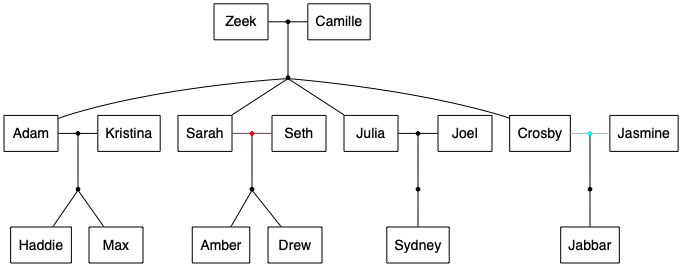

# parenthood

## intro

The idea behind this is to find a convenient way to represent relationships,
both simple to textually represent and possible to graph as well.

This can be useful during a complex book or a long tv series.

One could even have different versions of the hierarchy evolve over time,
to represent bonds that were lost, evolution and avoid spoiling.

### example ppl file

```
Zeek + Camille
  Adam
  Sarah
  Julia
  Crosby

Adam + Kristina
  Haddie
  Max

Sarah +/ Seth
  Amber
  Drew

Julia + Joel
  Sydney

Crosby .. Jasmine
  Jabbar
```

This would output this result graphviz data: [parenthood.gv](public/parenthood.gv).

And using graphviz you would get:

.

## the PPL format

The ppl format is a text file with a set of relationship.

A relationship can be described by 2 people and an optional set of siblings

```
<person1> <relationship_kind> <person2>
    <sibling1>
    ...
    <siblingn>
```

relationship kinds can be:

- `..` seem to be getting along (rose)
- `+` together
- `+/` used to be together (red)

The simple parser ignores lines starting with `#`

### limitations

People names must be not have spaces as they aren't escaped in dot.  
The layout may get cluttered with too many people or people with many relationships.

## using the script to generate graphviz file

The Javascript module converts a ppl file to a graphviz dot compatible file,
able to render in any rendered such as [graphviz](http://graphviz.org/), [viz.js](http://viz-js.com/), etc.

Run it like this:

    node --experimental-modules ppl2dot.mjs parenthood.ppl # will output to parenthood.gv. provide the outfile if desired.

## generating diagrams

### in the browser

Check the [demo](https://josepedrodias.github.io/parenthood/demo.html).

### in the command line

```
# brew install graphviz (in mac)
# apt install graphviz (in many linuxes)
# choco install graphviz (in windows)

dot parenthood.gv -Tpng -O
dot parenthood.gv -Tsvg -O
dot parenthood.gv -Tpdf -O
```

## TODO

- support more robust names
- confirm bin works
- publish to npm

## reference

- graphviz on the web http://viz-js.com/
- graphviz spec
  - https://graphviz.gitlab.io/_pages/doc/info/lang.html
  - https://graphviz.gitlab.io/_pages/doc/info/attrs.html
  - https://www.graphviz.org/doc/info/shapes.html
- graphviz command-line https://www.graphviz.org/doc/info/command.html
- jest docs https://jestjs.io/docs/en/getting-started.html
- package.json spec https://docs.npmjs.com/files/package.json
