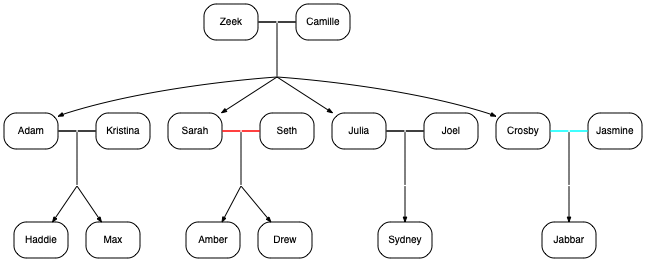

# parenthood

## intro

My idea here is to supply a simple, legible format to annotate on characters
and their relationships during the consumption of fictional stories, like books or tv shows. Nothing prevents you from depicting your family tree or company org chart.

Besides the format itself, which I exemplify below, I provide a parser that generates a graphviz representation of it, suitable to be rendered in popular formats such as png or pdf.

I see a good application of this, besides the reader writing it as he/she goes, as the author or publisher providing a version per chapter/episode in order to aid the consumer and not spoil with too much info.
Visiting each version allows you not only to resume where you left off but also a window into the evolution of the story.

### example ppl file:

```
Zeek + Camille
  Adam
  Sarah
  Julia
  Crosby

Adam + Kristina
  Haddie
  Max

Sarah +/ Seth
  Amber
  Drew

Julia + Joel
  Sydney

Crosby .. Jasmine
  Jabbar
```

### Its output

This would output this result graphviz data: [parenthood.gv](public/parenthood.gv).

And using graphviz you would get:

  
[svg diagram](public/parenthood.gv.svg),
[pdf diagram](public/parenthood.gv.pdf) ...

## The PPL format

The ppl format is a text file with a set of relationship.

A relationship can be described by 2 people and an optional set of siblings

```
<person 1> <relationship_kind> <person 2>
    <sibling 1>
    ...
    <sibling n>
```

relationship kinds can be:

- `..` seem to be getting along (cyan)
- `+` together
- `+/` used to be together (red)

Content after a hash `#` is considered comments and ignored.

The indentation for siblings is irrelevant. Number of spaces or tabs is irrelevant.

### limitations

The layout may get cluttered with too many people or people with many relationships.  
If you mention the same person with different names you're spawning a different person. Should be easy to spot.

## installing

`npm install parenthood`  
or  
`yarn add parenthood`

## using the script to generate graphviz file

The Javascript module converts a ppl file to a graphviz dot compatible file,
able to render in any rendered such as [graphviz](http://graphviz.org/), [viz.js](http://viz-js.com/), etc.

Run it like this:

`ppl2gv parenthood.ppl`

which will output `parenthood.gv`.  
provide the outfile as an additional argument if desired

## generating diagrams

### in the browser

Check the [demo](https://josepedrodias.github.io/parenthood/public/demo.html).
You need to focus outside the text area to refresh the diagram.  
Using [viz.js](http://viz-js.com/) here.
Think of this as a hack to allow you to experiment, nothing fancy...

### in the command line

#### setup grapviz

`brew install graphviz` (in mac)  
`apt install graphviz` (in many linuxes)  
`choco install graphviz` (in windows)

#### generate diagram in the format you prefer

`dot parenthood.gv -Tpng -O` (for png)  
`dot parenthood.gv -Tsvg -O` (for svg)  
`dot parenthood.gv -Tpdf -O` (for pdf)

## technical remarks

Using Javascript modules to share the most possible between browser and node. If you need to run with without modules, conversion to commonjs or window export is trivial.

The code itself has no dependencies. Jest brings a lot of deps along just to support mjs (sorry!).

I'm not an expert in graphviz and the parser is super simple. I wanted to get the point across and contributions are welcome!

## disclaimer

Some Parenthood TV Series characters were used here as an example.  
I have no affiliation to the series and don't intend to spoil. 🙏

## TODOs

### Technical

- confirm bin works via npm

### Features

- support several relationships with 1 character better
- way to group characters is groups (think venn diagram) to depict location / belonging to a group etc. Not sure yet how to do it without introducing complexity and break the layout

## reference

- [viz.js](http://viz-js.com/), one of several graphviz implementations for js
- graphviz spec
  - [lang](https://www.graphviz.org/doc/info/lang.html)
  - [attributes](https://www.graphviz.org/doc/info/attrs.html)
  - [shapes](https://www.graphviz.org/doc/info/shapes.html)
  - [command-line usage](https://www.graphviz.org/doc/info/command.html)
- [jest docs](https://jestjs.io/docs/en/getting-started.html)
- [package.json spec](https://docs.npmjs.com/files/package.json)
